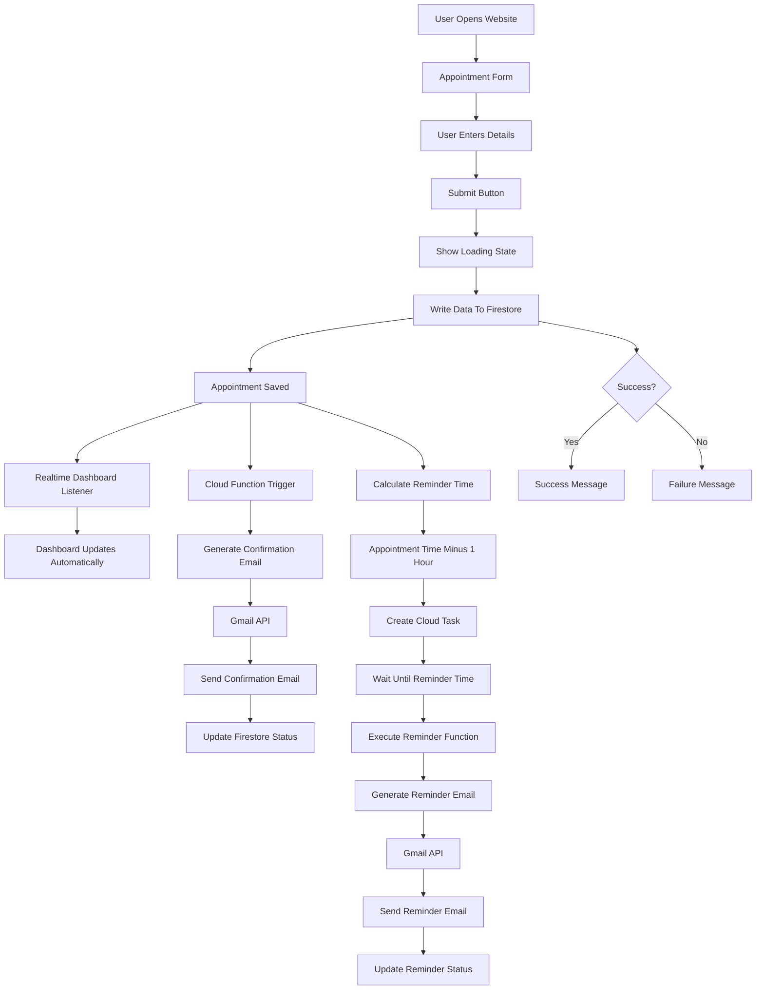

# Appointment Reminder System - Complete Architecture & Development Plan

## Project Overview

Build a complete Appointment Reminder System that allows users to:

1. Create appointments through a web form
2. Store appointments in Firebase Firestore
3. Display appointments in a live dashboard
4. Send confirmation emails automatically using Gmail API
5. Send reminder emails 1 hour before appointments
6. Track email delivery status
7. Update UI in real time

---

# Why This Architecture?

### Reason for Choosing Firebase

* Free tier available
* Real-time database updates
* Easy integration with React
* Cloud Functions support
* Fast development
* Suitable for interview project

### Reason for Choosing Gmail API

* Free
* Easy to verify
* No SMS cost
* No WhatsApp Business approval required
* Demonstrates automation capability

### Reason for Choosing Cloud Functions

* Secure backend execution
* Protect Gmail credentials
* Handle email sending
* Schedule reminder jobs

---

# Functional Requirements

## Appointment Form

Fields:

* Customer Name
* Email Address
* Appointment Date
* Appointment Time

Buttons:

* Submit Appointment

Validation:

* Name required
* Email required
* Appointment date required
* Appointment time required

---

## Dashboard

Display:

* Customer Name
* Email
* Appointment Time
* Appointment Date
* Confirmation Status
* Reminder Status
* Created Time

Dashboard Updates:

* Real-time updates
* No refresh required

---

## Email Features

### Confirmation Email

Automatically send immediately after appointment creation.

Example:

Subject:
Appointment Confirmed

Body:

Hello John,

Your appointment has been successfully scheduled.

Appointment Time:
June 10, 2026
10:00 AM

Thank you.

---

### Reminder Email

Automatically send 1 hour before appointment.

Example:

Subject:
Appointment Reminder

Body:

Hello John,

This is a reminder that your appointment starts in 1 hour.

Appointment Time:
June 10, 2026
10:00 AM

Thank you.

---

# Complete Architecture



---

# Complete Data Flow

Step 1

User opens website.

↓

Step 2

User enters:

* Name
* Email
* Appointment Date
* Appointment Time

↓

Step 3

User clicks Submit.

↓

Step 4

Frontend shows Loading.

↓

Step 5

Frontend sends appointment data to Firestore.

↓

Step 6

Firestore creates appointment document.

↓

Step 7

Realtime listener receives update.

↓

Step 8

Dashboard updates automatically.

↓

Step 9

Cloud Function triggers.

↓

Step 10

Confirmation email is generated.

↓

Step 11

Gmail API sends confirmation email.

↓

Step 12

Firestore updates:

confirmationSent = true

↓

Step 13

Reminder time calculated.

Appointment Time - 1 Hour

↓

Step 14

Cloud Task scheduled.

↓

Step 15

Cloud Task waits.

↓

Step 16

Reminder time reached.

↓

Step 17

Reminder email generated.

↓

Step 18

Gmail API sends reminder email.

↓

Step 19

Firestore updates:

reminderSent = true

↓

Step 20

Dashboard updates automatically.

---

# Firestore Collections

appointments

Document Structure:

```json
{
  "name": "John Doe",
  "email": "john@gmail.com",
  "appointmentDate": "2026-06-10",
  "appointmentTime": "10:00 AM",
  "confirmationSent": false,
  "reminderSent": false,
  "createdAt": "timestamp",
  "status": "scheduled"
}
```

---

# Folder Structure

project/

src/

components/

AppointmentForm.jsx

Dashboard.jsx

LoadingSpinner.jsx

SuccessMessage.jsx

ErrorMessage.jsx

services/

firebase.js

gmailService.js

appointmentService.js

hooks/

useAppointments.js

pages/

Home.jsx

functions/

sendConfirmationEmail.js

sendReminderEmail.js

scheduleReminder.js

public/

README.md

---

# UI Screens

## Screen 1

Appointment Form

Fields:

* Name
* Email
* Date
* Time

Buttons:

* Submit

States:

* Default
* Loading
* Success
* Error

---

## Screen 2

Live Dashboard

Columns:

* Name
* Email
* Date
* Time
* Confirmation Status
* Reminder Status

Real-time updates enabled.

---

# UI States

Loading State

Text:

Submitting Appointment...

Spinner visible.

---

Success State

Text:

Appointment Successfully Created.

---

Error State

Text:

Failed To Create Appointment.

Please Try Again.

---

# Backend Responsibilities

Cloud Function Responsibilities:

* Send confirmation email
* Schedule reminder
* Send reminder email
* Update Firestore status
* Handle errors

---

# Security Rules

Requirements:

* Prevent invalid writes
* Validate required fields
* Protect Firestore structure
* Prevent malformed data

Authentication not required for this project.

---

# Error Handling

Handle:

* Firestore write failure
* Gmail API failure
* Reminder scheduling failure
* Invalid appointment data

Store errors inside Firestore.

Example:

```json
{
  "error": "Email Sending Failed"
}
```

---

# Project Submission Explanation

This application is an appointment reminder system built using React, Firebase Firestore, Gmail API, Cloud Functions, and Cloud Tasks. Users can create appointments through a web form, and the data is stored in Firestore. The dashboard updates in real time using Firestore listeners. When an appointment is created, a Cloud Function automatically sends a confirmation email through Gmail API. A reminder task is also scheduled to send another email one hour before the appointment. The system tracks confirmation and reminder status inside Firestore, allowing the dashboard to reflect updates instantly.

---

# Interview Explanation

If asked:

"Explain your architecture."

Answer:

The frontend collects appointment information and saves it to Firestore. Firestore acts as the central source of truth. Real-time listeners update the dashboard immediately whenever data changes. A Cloud Function listens for newly created appointments and sends confirmation emails through Gmail API. The system also schedules a reminder task that executes one hour before the appointment time and sends a reminder email. Firestore stores all status updates, allowing the UI to stay synchronized in real time.
