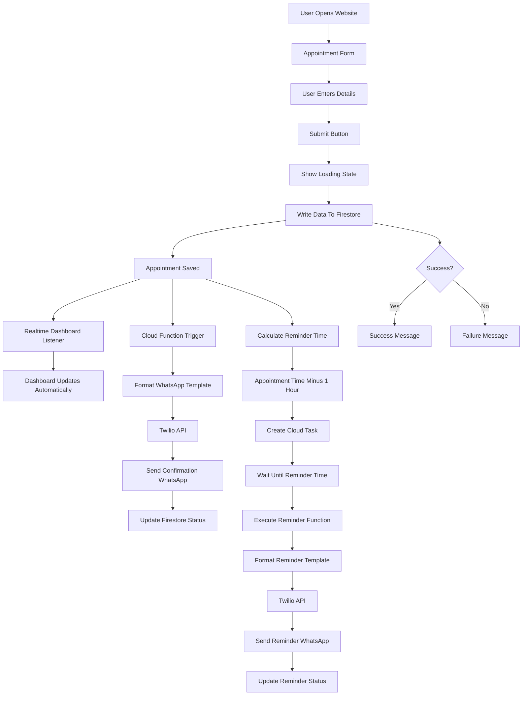

# Appointment Reminder System - Complete Architecture & Development Plan

## Project Overview

Build a complete Appointment Reminder System that allows users to:

1. Create appointments through a web form
2. Store appointments in Firebase Firestore
3. Display appointments in a live dashboard
4. Send confirmation WhatsApp messages automatically using Twilio WhatsApp API
5. Send reminder WhatsApp messages 1 hour before appointments
6. Track message delivery status
7. Update UI in real time

---

# Why This Architecture?

### Reason for Choosing Firebase

* Free tier available
* Real-time database updates
* Easy integration with React
* Cloud Functions support
* Fast development
* Suitable for interview project

### Reason for Choosing Twilio WhatsApp API

* Reliable global delivery
* Direct, high-engagement communication channel (WhatsApp)
* Real-world production grade integration
* Demonstrates third-party API orchestration capability

### Reason for Choosing Cloud Functions

* Secure backend execution
* Protect Twilio credentials
* Handle message sending & duplicate-prevention orchestration
* Schedule reminder jobs using Cloud Tasks

---

# Functional Requirements

## Appointment Form

Fields:

* Customer Name
* Phone Number (WhatsApp)
* Appointment Date
* Appointment Time

Buttons:

* Submit Appointment

Validation:

* Name required
* Phone required (E.164 format)
* Appointment date required
* Appointment time required

---

## Dashboard

Display:

* Customer Name
* Phone
* Appointment Time
* Appointment Date
* Confirmation Status
* Reminder Status
* Created Time

Dashboard Updates:

* Real-time updates
* No refresh required

---

## WhatsApp Features

### Confirmation WhatsApp

Automatically send immediately after appointment creation.

Example (Twilio Sandbox Template):
Your appointment is coming up on [Date/Time] at [Customer Name]

---

### Reminder WhatsApp

Automatically send 1 hour before appointment.

Example (Twilio Sandbox Template):
Your appointment is coming up on [Date/Time] at [Customer Name]

---

# Complete Architecture



---

# Complete Data Flow

Step 1

User opens website.

↓

Step 2

User enters:

* Name
* Phone Number
* Appointment Date
* Appointment Time

↓

Step 3

User clicks Submit.

↓

Step 4

Frontend shows Loading.

↓

Step 5

Frontend sends appointment data to Firestore.

↓

Step 6

Firestore creates appointment document.

↓

Step 7

Realtime listener receives update.

↓

Step 8

Dashboard updates automatically.

↓

Step 9

Cloud Function triggers.

↓

Step 10

Confirmation WhatsApp template is formatted.

↓

Step 11

Twilio API sends confirmation WhatsApp message.

↓

Step 12

Firestore updates:

confirmationSent = true

↓

Step 13

Reminder time calculated.

Appointment Time - 1 Hour

↓

Step 14

Cloud Task scheduled.

↓

Step 15

Cloud Task waits.

↓

Step 16

Reminder time reached.

↓

Step 17

Reminder WhatsApp template formatted.

↓

Step 18

Twilio API sends reminder WhatsApp message.

↓

Step 19

Firestore updates:

reminderSent = true

↓

Step 20

Dashboard updates automatically.

---

# Firestore Collections

appointments

Document Structure:

```json
{
  "customerName": "John Doe",
  "phone": "+918520845152",
  "appointmentTime": "timestamp",
  "confirmationSent": false,
  "reminderSent": false,
  "createdAt": "timestamp",
  "status": "Scheduled"
}
```

---

# Folder Structure

project/

src/

components/

AppointmentForm.jsx

Dashboard.jsx

LoadingSpinner.jsx

SuccessMessage.jsx

ErrorMessage.jsx

services/

firebase.js

appointmentService.js

hooks/

useAppointments.js

pages/

Home.jsx

functions/

services/
  orchestratorService.js
  whatsappService.js
  reminderSchedulerService.js
  reminderExecutionService.js

index.js

public/

README.md

---

# UI Screens

## Screen 1

Appointment Form

Fields:

* Name
* Phone Number
* Date
* Time

Buttons:

* Submit

States:

* Default
* Loading
* Success
* Error

---

## Screen 2

Live Dashboard

Columns:

* Name
* Phone
* Date
* Time
* Confirmation Status
* Reminder Status

Real-time updates enabled.

---

# UI States

Loading State

Text:

Submitting Appointment...

Spinner visible.

---

Success State

Text:

Appointment Successfully Created.

---

Error State

Text:

Failed To Create Appointment.

Please Try Again.

---

# Backend Responsibilities

Cloud Function Responsibilities:

* Orchestrate operations
* Duplicate prevention
* Send confirmation WhatsApp message
* Schedule reminder using Cloud Tasks
* Send reminder WhatsApp message
* Update Firestore status
* Handle errors

---

# Security Rules

Requirements:

* Prevent invalid writes
* Validate required fields (E.164 phone format)
* Protect Firestore structure
* Prevent malformed data

Authentication not required for this project.

---

# Error Handling

Handle:

* Firestore write failure
* Twilio API failure
* Reminder scheduling failure
* Invalid appointment data

Store errors inside Firestore.

Example:

```json
{
  "errorMessage": "Twilio Sandbox API Validation Failed"
}
```

---

# Project Submission Explanation

This application is an appointment reminder system built using React, Firebase Firestore, Twilio WhatsApp API, Cloud Functions, and Cloud Tasks. Users can create appointments through a web form, and the data is stored in Firestore. The dashboard updates in real time using Firestore listeners. When an appointment is created, a Cloud Function automatically formats and sends a confirmation WhatsApp message through the Twilio API. A reminder task is also scheduled using Google Cloud Tasks that executes exactly one hour before the appointment time and sends a reminder WhatsApp message. Firestore stores all status updates, allowing the UI to stay synchronized in real time.

---

# Interview Explanation

If asked:

"Explain your architecture."

Answer:

The frontend collects appointment information and saves it to Firestore. Firestore acts as the central source of truth. Real-time listeners update the dashboard immediately whenever data changes. A Cloud Function listens for newly created appointments, checks for duplicate submissions, and sends confirmation WhatsApp messages through the Twilio Sandbox API. The system also calculates and schedules a Cloud Task that executes exactly one hour before the appointment time and triggers the reminder WhatsApp message. Firestore stores all status updates and error states, allowing the UI grid to stay perfectly synchronized in real time.
